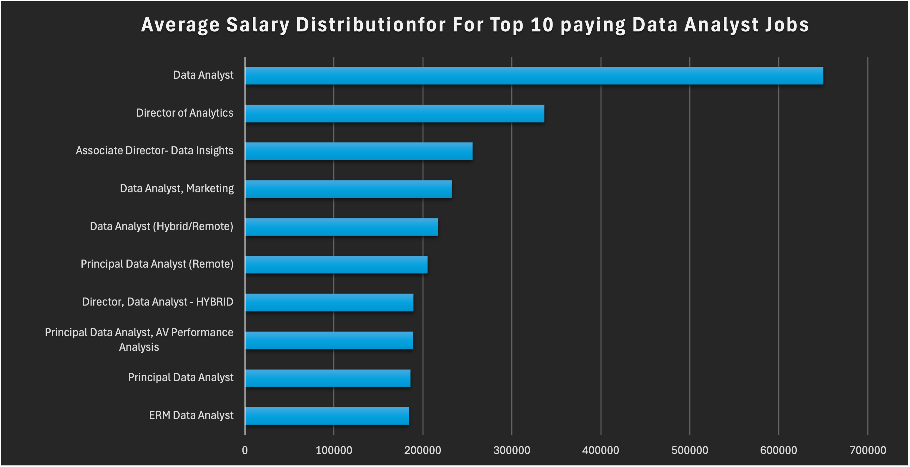
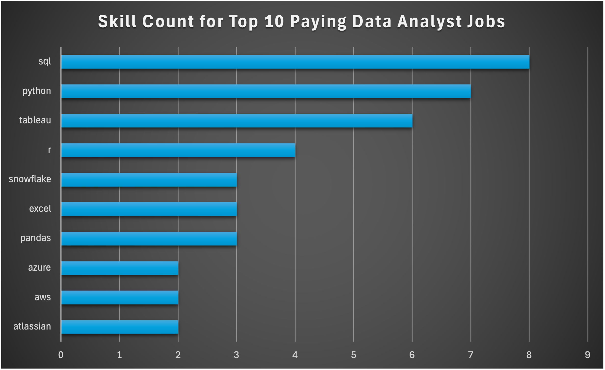

# Introduction
Dive into the data analyst job market. This project explores top paying jobs, in demand skills, and where high demand meets high salary in data analytics,

SQL queries: [project_sql folder](/sql_project/)

### The questions I wanted to answer through my SQL queries were: 
1. What are the top paying data analyst jobs?
2. What skills are required for these top paying jobs? 
3. What skills are most in demand for data analysts?
4. Which skills are associated with higher salaries?
5. What are the most optimal skills to learn? 

# Tools I Used 
In my dive into the data analyst job market, I gained experience in several key tools:

- **SQL**: The main tool in my analysis, allowing me to query the database, and find important insights.

- **PostgreSQL**: The database management system, ideal for handling the job posting data.

- **Visual Studio Code**: Used for database management and executing SQL queries.

- **Git & GitHub**: Essential for version control and sharing my SQL scripts and analysis, allowing collaboration and project tracking.

# The Analysis
Each query for this project aimed at investigating specific aspects of the data analyst job market. Here's how I approached question:

### 1. Top paying Data Analyst Jobs
To identify the highest paying roles, I filtered data analyst positions by average yearly salary and location, focusing on New York and remote jobs. This query highlights the high paying opportunities in the field.

```sql
SELECT
    job_id,
    job_title,
    job_location,
    job_schedule_type,
    salary_year_avg,
    job_posted_date,
    name AS company_name
FROM
    job_postings_fact
LEFT JOIN
    company_dim ON job_postings_fact.company_id = company_dim.company_id
WHERE 
    job_title_short = 'Data Analyst' AND (job_location = 'New York' OR job_location = 'Anywhere')
    AND salary_year_avg IS NOT NULL
ORDER BY
    salary_year_avg DESC
LIMIT 10;
```
Here's the breakdown of the top data
analyst jobs in 2023:

- **Wide Salary Range:** Top 10 paying data analyst roles span from $184,000 to $650,000, indicating significant salary potential in the field.

- **Diverse Employers:** Companies like SmartAsset, Meta, and AT&T are among those offering high salaries, showing a broad interest across different industries.

- **Job Title Variety:** There's a high diversity in job titles, from Data Analyst to Director of Analytics, reflecting varied roles and specializations within data analytics.


*Bar graph visualizing the salary for the top 10 salaries for data analysts, I generated this graph in Excel from my SQL query results*

### 2. Skills for Top Paying Jobs
To understand what skills are required for the top paying jobs, I joined the job postings with the skills data, providing insights into what employers value.

```SQL
WITH top_paying_jobs AS( 
    SELECT
        job_id,
        job_title,
        salary_year_avg,
        name AS company_name
    FROM
        job_postings_fact
    LEFT JOIN
        company_dim ON job_postings_fact.company_id = company_dim.company_id
    WHERE 
        job_title_short = 'Data Analyst' AND (job_location = 'New York' OR job_location = 'Anywhere')
        AND salary_year_avg IS NOT NULL
    ORDER BY
        salary_year_avg DESC
    LIMIT 10
)

SELECT 
    top_paying_jobs.*,
    skills
FROM top_paying_jobs
INNER JOIN skills_job_dim 
    ON top_paying_jobs.job_id = skills_job_dim.job_id
INNER JOIN skills_dim
    ON skills_job_dim.skill_id = skills_dim.skill_id
ORDER BY
    salary_year_avg DESC
```
Here's the breakdown of the most demanded skills for the top 10 highest paying data analyst jobs in 2023:

- **SQL** is leading with with a count of 8.

- **Python** follows behind with a count of 7.

- **Tableau** is also high with a count of 6. Other skills like **R**, **Snowflake**, **Pandas**, and **Excel** show a varying demand.


*Bar graph visualizing the count for the top 10 paying jobs for data analysts, I generated this graph in Excel from my SQL query results*

### 3. In Demand Skills for Data Analysts 
This query helped identify the skills most frequently requested in job postings, directing focus to areas with high demand. 

``` SQL
SELECT 
    skills,
    COUNT(skills_job_dim.job_id) AS demand_count
FROM job_postings_fact
INNER JOIN skills_job_dim
    ON job_postings_fact.job_id = skills_job_dim.job_id
INNER JOIN skills_dim
    ON skills_job_dim.skill_id = skills_dim.skill_id
WHERE
    job_title_short = 'Data Analyst' AND (job_location = 'New York' OR job_location = 'Anywhere')
GROUP BY
    skills
ORDER BY
    demand_count DESC
LIMIT 5;
```
Here's the breakdown of the most demanded skills for data analysts in 2023:

- **SQL** and **Excel** are the fundamental skills, emphasizing the need for strong foundational skills in data processing and spreadsheet manipulation.

- **Programming** and **Visualization Tools** like **Python**, **Tableau**, and **Power Bi** are essential, increasing the importance of technical skills in data storytelling and decision support.

| Skills  | Demand Count |
|---------|--------------|
| SQL     | 7,343        |
| Excel   | 4,639        |
| Python  | 4,359        |
| Tableau | 3,771        |
| Power Bi| 2,613        |

Table of the demand for the top 5 skills in data analyst job postings


### 4. Skill Based on Salary
Exploring the average salaries associated with different skills revealed which skills are the highest paying. 

``` SQL
SELECT
    skills,
    ROUND(AVG(salary_year_avg), 0) AS avg_salary
FROM 
    job_postings_fact
INNER JOIN skills_job_dim 
    ON job_postings_fact.job_id = skills_job_dim.job_id
INNER JOIN skills_dim
    ON skills_job_dim.skill_id = skills_dim.skill_id
WHERE 
    job_title_short = 'Data Analyst' AND salary_year_avg IS NOT NULL
    AND (job_location = 'New York' OR job_location = 'Anywhere')
GROUP BY
    skills
ORDER BY
    avg_salary DESC
LIMIT
    25;
```
Here's a breakdown of the result for top paying skills for Data Analysts:

- **High Demand for Big Data and ML Skills:** Top salaries are commanded by analysts skilled in big data technologies (PySpark, Couchbase), machine learning tools(DataRobot, Jupyter), and Python libraries(Pandas, NumPy), reflecting the industry's high demand of data processing and predictive modeling capabilities. 

- **Software Development and Deployment Proficiency:** Knowledge in development and deployment tools like (GitLab, Kubernetes, Airflow) indicates a crossover between data analysis and engineering, with a premium on skills that facilitate automation and efficient data pipeline management.

- **Cloud Computing Expertise:** Familiarity with cloud and data engineering tools like (Elasticsearch, Databricks, GCP) shows the growing importance of cloud-based analytics environments, suggesting that cloud proficiency significantly boosts earning potential in data analytics.

| Skills      |Average Salary|
|-------------|--------------|
| Pyspark     |     208,172  |
| Bitbucket   |     189,155  |
| Watson      |     160,515  |
| Couchbaseau |     160,515  |
| Datarobot   |     155,486  |  
| Gitlab      |     154,500  |
| Swift       |     153,750  |
| Jupyter     |     152,777  |
| Pandas      |     151,821  |
|Elasticsearch|     145,000  |

Table of the average salary for the top 10 paying skills for data analysts

### 5. Most optimal skills to learn 
Combining the insights from demand and salary data, this query aimed to pinpoint skills that are both in high demand and have high salaries, offering strategic focus for skill development. 

```SQL
WITH skills_demand AS(
    SELECT 
        skills_dim.skill_id,
        skills_dim.skills,
        COUNT(skills_job_dim.job_id) AS demand_count
    FROM job_postings_fact
    INNER JOIN skills_job_dim
        ON job_postings_fact.job_id = skills_job_dim.job_id
    INNER JOIN skills_dim
        ON skills_job_dim.skill_id = skills_dim.skill_id
    WHERE
        job_title_short = 'Data Analyst' AND salary_year_avg IS NOT NULL
        AND (job_location = 'New York' OR job_location = 'Anywhere')
    GROUP BY
        skills_dim.skill_id
),


average_salary AS(
    SELECT
    skills_dim.skill_id,
    skills_dim.skills,
    ROUND(AVG(salary_year_avg), 0) AS avg_salary
    FROM 
        job_postings_fact
    INNER JOIN skills_job_dim 
        ON job_postings_fact.job_id = skills_job_dim.job_id
    INNER JOIN skills_dim
        ON skills_job_dim.skill_id = skills_dim.skill_id
    WHERE 
        job_title_short = 'Data Analyst' AND salary_year_avg IS NOT NULL
        AND (job_location = 'New York' OR job_location = 'Anywhere')
    GROUP BY
        skills_dim.skill_id
)


SELECT 
    skills_demand.skill_id,
    skills_demand.skills,
    demand_count,
    avg_salary
FROM
    skills_demand
INNER JOIN average_salary
    ON skills_demand.skill_id = average_salary.skill_id
ORDER BY
    demand_count DESC,
    avg_salary DESC
LIMIT 20;
```
Here's a breakdown of the most optimal skills for Data Analysts in 2023:

- **High Demand Programming Languages:** SQL and R stand out with their high demand counts of 241 and 150. Despite their high demand, their average salaries are around $100,814 for Python and $100,050 for R, indicating that proficiency in these languages is highly valued but also widely available.

- **Business Intelligence and Visualization Tools:** Tableau and Looker, with demand counts of 233 and 50, and average salaries around $98,925 and $103,119, highlighting the critical role of data visualization and business intelligence. 

- **Database Technologies:** The demand for skills in traditional and NoSQL databases (Oracle, SQL Server, NoSQL) with average salaries ranging from $97,054 to $104,534, reflects the need for data storage, retrieval, and management expertise.

| Skills    | Demand Count | Average Salary|
|-----------|--------------|---------------|
| SQL       |     405      |    97,054     |
| Excel     |     259      |    87,145     |
| Python    |     241      |    100,814    |
| Tableau   |     233      |    98,925     |
| R         |     150      |    100,050    |
| sas       |     126      |    197,804    |
| Power Bi  |     111      |    97,212     |
| Powerpoint|     58       |    88,701     |
| Looker    |     50       |    103,119    |
| Word      |     48       |    82,576     |

# What I learned

Throughout this project, I've improved my SQL knowledge and skills:

- **Complex Query Crafting:** Advanced SQL techniques were developed, like combining multiple tables and using WITH clauses to create temporary tables for complex query operations.

- **Data Aggregation:** Aggregate functions such as COUNT() and AVG() were used alongside GROUP BY to summarize and analyze data effectively.

- **Analytical Skills:** Real-world questions were translated into structured SQL queries to generate useful insights and actionable results.

# Conclusion

### Insights

1. **Top-Paying Data Analyst Jobs**: The highest-paying jobs for data analysts that allow remote work and/or are in New York offer a wide range of salaries, the highest at $650,000.

2. **Skills for Top-Paying Jobs:** High-paying data analyst jobs require advanced proficiency in
SQL, suggesting it's a critical skill for earning a top salary.

3. **Most In-Demand Skills:** SQL is also the most demanded skill in the data analyst job market, making it essential for the job.

4. **Skills with Higher Salaries:** Specialized skills, such as SV and Solidity, are associated with the highest average salaries. 

5. **Optimal Skills for Job Market Value:** SQL leads in demand and offers for a high average salary, positioning it as one of the most optimal skills for data analysts to learn.

### Closing Thoughts

This project enhanced my SQL skills and provided valuable insights into the data analyst job market. The findings from the analysis serve as a guide to prioritizing skill development. As an aspiring data analyst I can better position themselves in a competitive job market by focusing on high demand skills. This project highlights the importance of continuous learning and adaptation to emerging trends in the field of data analytics.
